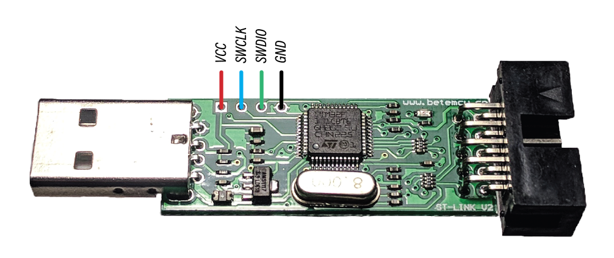
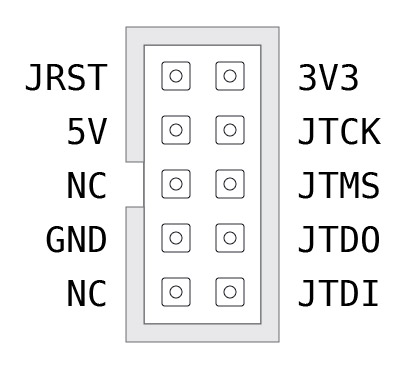

# Installing DirtyJTAG on a "Baite" ST-Link clone

Baite dongles are cheap SWD programmer dongles that are widely avaiable on chinese marketplaces. Unlike their [aluminium counterparts](install-stlinkv2.md), they have an extra pin for JTAG reset.

## Requirements

 * A Baite dongle
 * An ST Link v2-compatible SWD programmer
 * [stlink](https://github.com/texane/stlink) and OpenOCD installed on your computer

## SWD wiring

To gain access to the internal SWD connector in your Baite dongle, pry apart the case at the header connector. The two halves hold the case in place using weak plastic retainer clips, you should be able to take it apart without any tool.



The unpopulated connector can fit a generic 2.54mm male header if needed. When programming the Baite dongle, **it is advised to not plug the Baite dongle via USB** to avoid confusion while flashing DirtyJTAG (you might brick your ST-Link programmer!).

## Unlocking the memory

Like every other ST-Link clone on the market, its flash memory is protected against SWD readouts. To remove that protection we will have to use OpenOCD.

To start OpenOCD with the adequate settings for an ST-Link v2 programmer use this command:

```
openocd -f interface/stlink-v2.cfg -f target/stm32f1x.cfg
```

Then while keeping OpenOCD open, open a new terminal window and connect to OpenOCD server:

```
telnet localhost 4444
```

You now have an OpenOCD prompt (congratulations!). You may now enter the following OpenOCD commands to reset the MCU flash protection (and its content by the way).

```
halt
stm32f1x unlock 0
reset
exit
```

## Flashing DirtyJTAG

Download a binary version of DirtyJTAG (make sure to get the `baite` build!) or [compile it yourself](building-dirtyjtag.md), then flash it using `st-flash`:

```
st-flash write /path/to/dirtyjtag.baite.bin 0x8000000
```

## Pinout


