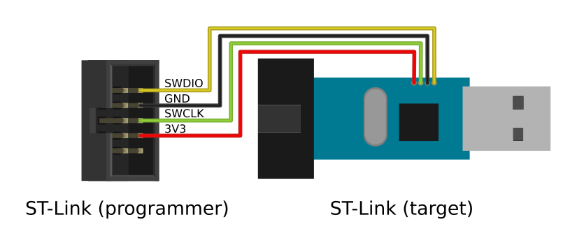
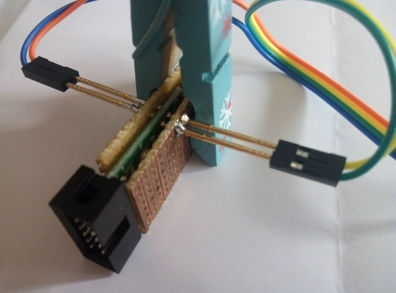
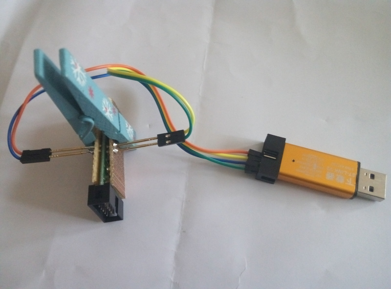

# Complete instructions for installing DirtyJTAG on a $2 chinese ST-Link clone (SWD method)

In order to follow this tutorial, you will need an SWD programmer, like another $2 ST-Link dongle. If you don't have any lying around, you can follow the [DFU method](install-stlinkv2-dfu.md).

The $2 chinese ST-Link clones that you can find on Aliexpress/eBay are based on a STM32F101 chip. They can be repurposed into a JTAG adapter using the DirtyJTAG firmware. However, due to the limited number of GPIO available to the user, only the bare minimum JTAG pins are available : `TDI/TDO/TMS/TCK` (no `SRST` or `TRST`).

## Taking apart the adapter

Press firmly the USB connector on a flat surface while holding the outer aluminium casing. This will release the PCB from its casing.


## Install DirtyJTAG firmware

I chose to use another $2 ST-Link programmer as my SWD programmer. Connect them together like this :



Do not plug your ST-Link (target) in a USB port yet. Install [stlink](https://github.com/texane/stlink) on your computer, and download a compiled release of DirtyJTAG for ST-Link adapters ([available here](https://github.com/jeanthom/dirtyjtag/releases)). Enter this command to program the STM32 :

```
st-flash write /path/to/dirtyjtag-stlink.bin 0x8000000
```

If for some reason the flashing process fails because the reported flash size is 0, [there is a fix](https://github.com/texane/stlink/issues/172#issuecomment-347887271).

If you have pogopins around, you could make your own flashing jig by soldering 4 of those on 2 pieces of stripboard, and hold them with a clothespin:




Otherwise some male to female header cable works great, it fits the pad hole snugly and doesn't make a loose connection.


## Using your *brand new* DirtyJTAG dongle with a JTAG target

This is the new pinout for your DirtyJTAG dongle. You may want to print it and glue it to the case for practical reasons.


Install [UrJTAG with DirtyJTAG support](urjtag-dirtyjtag.md). Plug your DirtyJTAG dongle, and check with the `lsusb` command that a new device with `0x1209/0xC0CA` as its USB VID/PID has appeared.

```
$ jtag
UrJTAG 0.10 #
Copyright (C) 2002, 2003 ETC s.r.o.
Copyright (C) 2007, 2008, 2009 Kolja Waschk and the respective authors

UrJTAG is free software, covered by the GNU General Public License, and you are
welcome to change it and/or distribute copies of it under certain conditions.
There is absolutely no warranty for UrJTAG.

warning: UrJTAG may damage your hardware!
Type "quit" to exit, "help" for help.

jtag> cable dirtyjtag
jtag> detect

```
